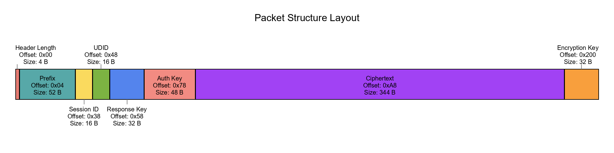
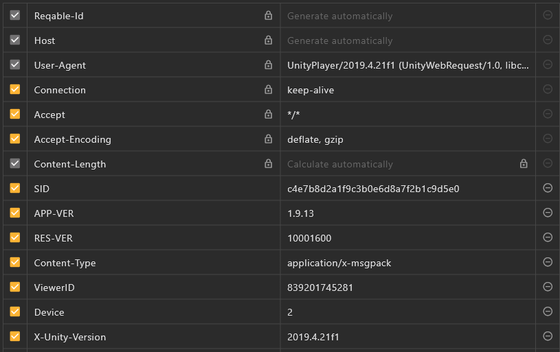

# Uma Musume network protocol notes (original research)

This document summarizes reversing notes of Uma Musume’s client/server protocol and maps them to
this repository so you can reproduce and extend the work with TypeScript tools. The original raw
notes remain below for completeness.

Use responsibly. Reverse engineering may be restricted by law or the game’s ToS.

## Contents

- TL;DR: wire format in 60 seconds
- Interception and anti-debug bypass (field notes)
- Request/response structure
- SID header (challenge/response)
- Where this repo implements it (files and links)

### TL;DR: wire format in 60 seconds

- Transport: HTTP/1.1 to api.games.umamusume.com
- Body: a single Base64 string of the binary request
- Request = [4B LE blob1_len] [blob1] [blob2]
  - blob1 = prefix || session_id(16) || udid_raw(16) || response_key(32) || auth_key(48)
  - blob2 = AES‑256‑CBC(ciphertext) || encryption_key(32)
- Encryption: AES‑256‑CBC; IV from UDID canonical (remove dashes, first 16 ASCII)
- Payload framing: msgpack
  - Typical: length‑prefixed [4B len] [msgpack]
  - Some tools: streamed key/value msgpack (kv‑stream)

See also framing docs: ../code/type-aliases/FramingMode.md

### Interception and anti‑debug (field notes)

- No SSL pinning observed; standard HTTP proxies work on rooted devices
- Anti‑debug in lib**4e06**.so; practical bypass via Frida Gadget (e.g., ZygiskFrida)

### Request/response structure

- blob1: auth/session header (variable prefix + 112B fixed tail)
- blob2: encrypted payload; plaintext usually [4B len] [msgpack(payload)], AES‑256‑CBC, 32B key
  appended
- Responses: same ciphering as blob2; IV derived from the request UDID

### SID header (challenge/response)

Next request’s session_id (blob1) and HTTP header SID = md5(prev_response.data_headers.sid +
secret_salt)

### Where this repo implements it

- Builder: src/lib/encrypt/payload.service.ts
- Decoder: src/lib/decrypt/response.service.ts
- Parsed request/header: src/lib/models/protocol.model.ts
- Heuristic unpacker: src/lib/decrypt/shared/unpacker.util.ts
- Programmatic API: src/lib/runtime-client.ts
- CLI tools: src/cli/index.ts

---

<!-- markdownlint-disable MD033 MD046 -->
<details>
<summary>Original notes (verbatim)</summary>

Tried my hand at reversing this game's server communication and mostly succeeded, but couldn't find
anything of major interest. Figured I'd post my findings in case someone else wants to continue this
and come up with something interesting.

Bypassing Anti-Debugger Checks

The global APK comes packaged with a library named lib**4e06**.so that loads a data1.dat file that
is essential to the game process and does anti-debugger checks and such.

No need to struggle with reversing this. We can just inject the Frida gadget from Zygote. You can do
this manually or, more conveniently, by using ZygiskFrida with a kernel root solution and
ZygiskNext. Just follow the install instructions on the GitHub page and set these settings:

    Set com.cygames.umamusume as the target app.
    Set the attach delay to about 4 seconds (increase it if you're on a low-end device).

This should allow us to attach Frida undetected after all the game's checks and initialization have
finished.

Packet Interception & Structure

There is no SSL Pinning, and traffic is sent using HTTP/1.1, so a standard interception tool like
Reqable or HttpCanary on a rooted device works perfectly for capturing packets.

Requests are sent to `https://api.games.umamusume.com`. The request body is a single Base64 encoded
string. Decoding this string reveals a binary structure composed of a length-prefixed header (blob1)
followed by an encrypted payload (blob2).

Deconstructing the Request Body

Reversal Process

Initially tried to dump the game using Il2CppDumper or Il2CppInspector, but even with
global-metadata and libil2cpp.so from memory both tools failed. In order to save time I used
Zygisk-Il2CppDumper, this generated a dump.cs with offsets for methods, structs and such. I couldn't
easily find a parser that would generate an IDA script that would rename sub\_ function to their
actual names, so I asked Gemini to create a script. Now with named functions, I decided to hook
encryption methods from the game's namespace (Gallop), amongst the results were calls to
Gallop.CryptAES.Encrypt/DecryptRJ256 that had msgpack as inputs. After looking at stack traces I
noticed both of these were called from Gallop.HttpHelper.CompressRequest and .DecompressRequest
respectively. With named functions and Frida showing functions inputs and outputs, figuring out
packet structure was easier. My findings are presented below.

Request structure

The final binary package is assembled from three main parts before being Base64 encoded. Here they
are in order:

    Length of Blob1: A 4-byte little-endian integer specifying the total size of the unencrypted `blob1` that immediately follows.
    Blob1 (Authentication Header): This is an unencrypted block of data used for authentication and session management. It's constructed by concatenating several pieces of information. The last 112 bytes are fixed fields, preceded by a variable-length prefix.
        Prefix: A variable-length block of data. Its purpose is unconfirmed, but it may contain versioning or metadata.
        Session ID: A 16-byte value derived from the server's previous response (more on this in the SID Header section).
        UDID: The 16-byte raw representation of the user's unique device identifier.
        Response Key: A randomly generated 32-byte key.
        Auth Key: A static 48-byte key stored by the game.
    Blob2 (Encrypted Payload): This blob contains the actual game data (e.g., API call parameters). The data undergoes a two-step preparation before encryption:
        Serialization & Length-Prefixing: The game data is first serialized into a binary format using msgpack. A 4-byte little-endian integer representing the length of this msgpack data is then prepended to it.
        Encryption: The length-prefixed msgpack data is then encrypted using AES-256-CBC, implemented in the `Gallop_CryptAES::EncryptRJ256` function.
            Encryption Key: A new 32-byte key is randomly generated for every single request. This key is used for encryption and is then appended to the end of the resulting ciphertext. To decrypt, you simply read the last 32 bytes of `blob2` to get the key.
            IV (Initialization Vector): The 16-byte IV is static and derived directly from the user's UDID by taking the first 16 bytes of the hyphen-removed string.



This complete binary package is then Base64 encoded to form the final request body.

Response structure

Seems to be encrypted with the exact same method as blob2, should be investigated further tho.

SID Header

The final component is the `SID` request header.



Captured packets could be replayed once, but a second replay would fail. The "SID" header acts as a
challenge-response nonce.

The server uses this mechanism to validate requests. To successfully send a new request, you must:

    Take the "sid" value from the "data_headers" of the previous server response.
    Append the static secret salt to it.
    Calculate the MD5 hash of the resulting combined string.
    This new hash becomes the Session ID value inside "blob1" for the next client request and it also becomes the new SID header value.

Below is a PoC Python script for automating communication, along with a Frida script to gather the
necessary inputs.

Proof-of-Concept Python Tool Code:

```python
    # A PoC tool to decrypt, modify, and re-encrypt game traffic.
    # Requires pycryptodome and msgpack: pip install pycryptodome, msgpack
    import base64
    import msgpack
    import os
    import json
    import hashlib
    import sys
    import tempfile
    import subprocess
    import argparse
    from Crypto.Cipher import AES
    from Crypto.Util.Padding import pad, unpad

    # --- Core Cryptographic & Session Constants (REPLACE WITH YOUR VALUES) ---
    SECRET_SALT = "co!=Y;(UQCGxJ_n82"
    UDID = "4c14a866-bc45-4ec2-932e-6369cc77cdf1"
    LAST_SERVER_SID_EXAMPLE = "JDEdNc3dTEU3MHzjQJdGDI242lcTa2dgGg"
    DEFAULT_REQUEST_B64 = "<PASTE YOUR CAPTURED REQUEST B64 HERE>"
    DEFAULT_RESPONSE_B64 = "<PASTE YOUR CAPTURED RESPONSE B64 HERE>"


    def decode_all_bytes(obj):
        if isinstance(obj, dict):
            return {decode_all_bytes(k): decode_all_bytes(v) for k, v in obj.items()}
        elif isinstance(obj, list):
            return [decode_all_bytes(i) for i in obj]
        elif isinstance(obj, bytes):
            return obj.decode('utf-8', 'replace')
        else:
            return obj

    def parse_header(header_data: bytes) -> dict:
        """Parses blob1 into its constituent parts."""
        if len(header_data) < 112:
            raise ValueError("Header data too short for fixed fields.")

        # The header has a variable-length prefix followed by 112 bytes of fixed-size fields.
        # We parse these fixed fields from the end of the byte array cause.
        return {
            "auth_key":     header_data[-48:],
            "response_key": header_data[-80:-48],
            "udid":         header_data[-96:-80],
            "session_id":   header_data[-112:-96],
            "prefix":       header_data[:-112]
        }

    def decrypt_payload(encrypted_payload: bytes, udid: str) -> tuple[bytes, bytes]:
        """Decrypts blob2 and extracts the AES key."""
        if len(encrypted_payload) < 32:
            raise ValueError("Encrypted payload is too short to contain a key.")

        key_bytes = encrypted_payload[-32:]
        ciphertext = encrypted_payload[:-32]

        udid_clean = udid.replace("-", "")
        iv = udid_clean[:16].encode("utf-8")

        cipher = AES.new(key_bytes, AES.MODE_CBC, iv)
        padded_payload = cipher.decrypt(ciphertext)
        return unpad(padded_payload, AES.block_size, style="pkcs7"), key_bytes

    def encrypt_request_payload(payload_data: dict, udid: str, encryption_key: bytes) -> bytes:
        """Serializes, length-prefixes, pads, and encrypts blob2."""
        packed_payload = msgpack.packb(payload_data, use_bin_type=True)
        # The msgpack data itself is prefixed with its own length.
        prefixed_payload = len(packed_payload).to_bytes(4, "little") + packed_payload

        udid_clean = udid.replace("-", "")
        iv = udid_clean[:16].encode("utf-8")

        cipher = AES.new(encryption_key, AES.MODE_CBC, iv)
        padded_payload = pad(prefixed_payload, AES.block_size, style="pkcs7")

        # The encryption key is appended to the ciphertext.
        return cipher.encrypt(padded_payload) + encryption_key

    def unpack_message(decrypted_data: bytes, raw: bool = False) -> dict:
        """Extracts the msgpack data from its length-prefixed container."""
        msg_len = int.from_bytes(decrypted_data[:4], "little")
        msgpack_data = decrypted_data[4 : 4 + msg_len]
        return msgpack.unpackb(msgpack_data, raw=raw)

    def edit_data_in_editor(header_info: dict, payload_dict: dict) -> tuple[dict, dict]:
        """Opens the parsed data in a temp JSON file for interactive editing."""
        printable_payload = decode_all_bytes(payload_dict)
        editable_data = {
            "blob1_header": {k: v.hex() for k, v in header_info.items()},
            "blob2_payload": printable_payload
        }
        with tempfile.NamedTemporaryFile(mode='w+', delete=False, suffix='.json', encoding='utf-8') as tf:
            temp_filename = tf.name
            tf.write("#" * 60 + "\n# Edit JSON values, save, and close the editor to continue.\n" + "#" * 60 + "\n\n")
            json.dump(editable_data, tf, indent=4)
        try:
            print("\n[INFO] Opening data for interactive editing in the default text editor...")
            editor = os.getenv('EDITOR')
            if editor:
                subprocess.run([editor, temp_filename], check=True)
            elif sys.platform == "win32":
                subprocess.run(["notepad.exe", temp_filename], check=True)
            elif sys.platform == "darwin":
                subprocess.run(["open", "-t", temp_filename], check=True)
            else:
                subprocess.run(["xdg-open", temp_filename], check=True)

            print("[INFO] Editor closed. Reading modified data from temporary file...")
            with open(temp_filename, 'r', encoding='utf-8') as tf:
                content = tf.read()

            json_content_str = '\n'.join(line for line in content.splitlines() if not line.strip().startswith('#'))
            modified_data = json.loads(json_content_str)
            return modified_data.get("blob1_header", {}), modified_data.get("blob2_payload", {})
        finally:
            os.remove(temp_filename)

    def handle_decrypt_request(args):
        print("--- Mode: Decrypt Client Request ---")
        try:
            full_body_bytes = base64.b64decode(args.b64_input)

            # 1. Read the 4-byte length prefix for blob1.
            header_len = int.from_bytes(full_body_bytes[:4], "little")
            split_point = 4 + header_len

            # 2. Split the payload into blob1 and blob2.
            header_data = full_body_bytes[4:split_point]
            encrypted_payload = full_body_bytes[split_point:]

            print("\n--- Parsed Header (Blob 1) ---")
            parsed_header = parse_header(header_data)
            for key, value in parsed_header.items():
                print(f"{key:>12}: {value.hex()}")

            decrypted_payload, key_used = decrypt_payload(encrypted_payload, UDID)
            unpacked_data = unpack_message(decrypted_payload, raw=False)

            print("\n--- Decrypted Payload (Blob 2) ---")
            print(f"Decryption Key: {key_used.hex()}")
            print("Payload Content:")
            print(json.dumps(unpacked_data, indent=4))

        except Exception as e:
            print(f"\n[ERROR] An unexpected error occurred: {e}")

    def handle_decrypt_response(args):
        print("--- Mode: Decrypt Server Response ---")
        try:
            encrypted_payload = base64.b64decode(args.b64_input)
            decrypted_payload, key_used = decrypt_payload(encrypted_payload, UDID)
            unpacked_data_raw = unpack_message(decrypted_payload, raw=True)
            printable_data = decode_all_bytes(unpacked_data_raw)

            print("\n--- Decrypted Response ---")
            print(f"Decryption Key: {key_used.hex()}")
            print("Response Content:")
            print(json.dumps(printable_data, indent=4))

        except Exception as e:
            print(f"\n[ERROR] An unexpected error occurred: {e}")

    def handle_rebuild_request(args):
        print("--- Mode: Rebuild Client Request ---")
        try:
            # Decrypt the provided template request.
            full_body_bytes = base64.b64decode(args.b64_input)
            header_len = int.from_bytes(full_body_bytes[:4], "little")
            header_data = full_body_bytes[4 : 4 + header_len]
            encrypted_payload = full_body_bytes[4 + header_len:]

            header_info = parse_header(header_data)
            decrypted_payload, template_encryption_key = decrypt_payload(encrypted_payload, UDID)
            unpacked_data = unpack_message(decrypted_payload, raw=True)
            print("[INFO] Successfully decrypted the request template.")

            # Update header fields for the new request.
            combined_string = LAST_SERVER_SID_EXAMPLE + SECRET_SALT
            header_info['session_id'] = hashlib.md5(combined_string.encode('utf-8')).digest()
            print(f"[INFO] Calculated new session_id: {header_info['session_id'].hex()}")

            header_info['response_key'] = os.urandom(32)
            print(f"[INFO] Generated new response_key: {header_info['response_key'].hex()}")

            # Allow interactive modification of data.
            modified_header_hex, new_payload_data = edit_data_in_editor(header_info, unpacked_data)

            # Re-assemble the request.
            print("\n--- Assembling New Request ---")
            modified_header_bytes = {k: bytes.fromhex(v) for k, v in modified_header_hex.items()}

            new_header = (
                modified_header_bytes['prefix'] +
                modified_header_bytes['session_id'] +
                modified_header_bytes['udid'] +
                modified_header_bytes['response_key'] +
                modified_header_bytes['auth_key']
            )

            # Note: Re-using the key from the template for simplicity.
            # A real implementation might generate a new random key.
            new_encrypted_payload = encrypt_request_payload(new_payload_data, UDID, template_encryption_key)

            full_body = len(new_header).to_bytes(4, 'little') + new_header + new_encrypted_payload
            final_b64 = base64.b64encode(full_body).decode('utf-8')

            print("\n--- Generated New Request Body (Base64) ---")
            print(final_b64)

        except Exception as e:
            print(f"\n[ERROR] An unexpected error occurred: {e}")

    if __name__ == "__main__":
        parser = argparse.ArgumentParser(
            description="A tool to decrypt, analyze, and rebuild encrypted application network traffic.",
            formatter_class=argparse.RawTextHelpFormatter
        )
        subparsers = parser.add_subparsers(dest="mode", required=True, help="The operating mode.")

        parser_req = subparsers.add_parser("decrypt-req", help="Decrypt and parse a full client request body.")
        parser_req.add_argument("-i", "--input", dest="b64_input", default=DEFAULT_REQUEST_B64, help="The Base64 encoded request string.")
        parser_req.set_defaults(func=handle_decrypt_request)

        parser_resp = subparsers.add_parser("decrypt-resp", help="Decrypt a server response body.")
        parser_resp.add_argument("-i", "--input", dest="b64_input", default=DEFAULT_RESPONSE_B64, help="The Base64 encoded response string.")
        parser_resp.set_defaults(func=handle_decrypt_response)

        parser_rebuild = subparsers.add_parser("rebuild-req", help="Decrypt, edit, and re-encrypt a request for replay.")
        parser_rebuild.add_argument("-i", "--input", dest="b64_input", default=DEFAULT_REQUEST_B64, help="The Base64 request template to modify.")
        parser_rebuild.set_defaults(func=handle_rebuild_request)

        args = parser.parse_args()
        args.func(args)
```

Frida wide net script

To gather inputs for the above script this can be used, I did not continue with figuring out source
of uuid, auth token and such, I just captured them and crafted new requests using them.

To compile the Frida script:

1. Initialize a node project: `npm init -y`
2. Install the bridge: `npm i frida-il2cpp-bridge`
3. Compile the script: `npx frida-compile -o output.js input.js`

This will produce a pure JS file. Attach to the Frida Gadget with:
`frida -U -l output.js -n Gadget`.

Code:

```javascript
import 'frida-il2cpp-bridge';

/**
 * Logs the content of an Il2Cpp.String.
 * @Param {string} name - The label for the log output.
 * @Param {NativePointer} strPtr - The pointer to the Il2Cpp.String object.
 */
function logIl2CppString(name, strPtr) {
  if (strPtr.isNull()) {
    console.log(`   ${name}: null`);
    return;
  }
  try {
    const str = new Il2Cpp.String(strPtr);
    console.log(`   ${name}: "${str.content}"`);
  } catch (e) {
    console.error(`   [!] Failed to read string ${name} at ${strPtr}: ${e.message}`);
  }
}

/**
 * Logs the content of an Il2Cpp byte array as a hexdump.
 * @Param {string} name - The label for the log output.
 * @Param {NativePointer} arrPtr - The pointer to the Il2Cpp.Array object (System.Byte[]).
 */
function logIl2CppByteArray(name, arrPtr) {
  if (arrPtr.isNull()) {
    console.log(`   ${name}: null`);
    return;
  }
  try {
    const arr = new Il2Cpp.Array(arrPtr);
    const length = arr.length;
    console.log(`   ${name} (length: ${length}):`);
    console.log(
      hexdump(arr.elements, {
        length: length,
      }),
    );
  } catch (e) {
    console.error(`   [!] Failed to read byte array ${name} at ${arrPtr}: ${e.message}`);
  }
}

Java.perform(function () {
  console.log('Waiting for Il2Cpp domain...');

  Il2Cpp.perform(function () {
    console.log('[+] Il2Cpp API is available. Attaching hooks...');

    try {
      const baseAddr = Il2Cpp.module.base;
      const makeMd5FuncOffset = 0x213671c;
      const concatCallInstructionOffset = 0x8c;
      const hookAddress = baseAddr.add(makeMd5FuncOffset).add(concatCallInstructionOffset);

      console.log(
        ` Attaching native hook to the String.Concat call site inside MakeMd5 at: ${hookAddress}`,
      );

      Interceptor.attach(hookAddress, {
        onEnter: function (args) {
          console.log('\n[+] Native Hook Hit: Salt for MD5 generation');
          const saltStringPtr = this.context.x1;
          const saltContent = new Il2Cpp.String(saltStringPtr).content;
          console.log(`       The Secret Salt Is: "${saltContent}"`);
        },
      });

      console.log('[+] Native hook for salt is active');
    } catch (e) {
      console.error('[!] Failed to attach native hook for MD5 salt:', e.message);
    }

    const assembly = Il2Cpp.domain.assembly('umamusume').image;
    console.log("[+] Assembly 'umamusume' loaded.");

    try {
      const AES256Crypt = assembly.class('Gallop.AES256Crypt');

      AES256Crypt.method('Encrypt', 2).implementation = function (message, iVString) {
        console.log('\n[+] Gallop.AES256Crypt.Encrypt called!');
        logIl2CppString('message', message);
        logIl2CppString('iVString', iVString);
        const ret = this.method('Encrypt', 2).invoke(message, iVString);
        logIl2CppString('RETURN', ret);
        console.log('---');
        return ret;
      };

      AES256Crypt.method('Decrypt', 2).implementation = function (encstr, iVString) {
        console.log('\n[+] Gallop.AES256Crypt.Decrypt called!');
        logIl2CppString('encstr', encstr);
        logIl2CppString('iVString', iVString);
        const ret = this.method('Decrypt', 2).invoke(encstr, iVString);
        logIl2CppString('RETURN', ret);
        console.log('---');
        return ret;
      };
    } catch (e) {
      console.error('[!] Failed to hook Gallop.AES256Crypt:', e.message);
    }

    try {
      const Certification = assembly.class('Gallop.Certification');

      Certification.method('get_Udid').implementation = function () {
        console.log('\n[+] Gallop.Certification.get_Udid called!');
        const ret = this.method('get_Udid').invoke();
        logIl2CppString('RETURN (UDID)', ret);
        console.log('---');
        return ret;
      };

      Certification.method('get_SessionId').implementation = function () {
        console.log('\n[+] Gallop.Certification.get_SessionId called!');
        const ret = this.method('get_SessionId').invoke();
        logIl2CppString('RETURN (SessionId)', ret);
        console.log('---');
        return ret;
      };

      Certification.method('GenerateUdid', 1).implementation = function (force) {
        console.log(`\n[+] Gallop.Certification.GenerateUdid called! force: ${force}`);
        this.method('GenerateUdid', 1).invoke(force);
        console.log('---');
      };
    } catch (e) {
      console.error('[!] Failed to hook Gallop.Certification:', e.message);
    }

    try {
      const CryptAES = assembly.class('Gallop.CryptAES');

      console.log('\n[+] DUMPING STATIC FIELDS for Gallop.CryptAES:');
      CryptAES.fields.forEach((field) => {
        if (field.isStatic) {
          try {
            const value = field.value;
            console.log(`   Static Field: ${field.name} (type: ${field.type.name})`);
            if (field.type.name === 'System.String') {
              logIl2CppString(`         Value`, value);
            } else if (field.type.name === 'System.Byte[]') {
              logIl2CppByteArray(`         Value`, value);
            } else {
              console.log(`         Value: ${value}`);
            }
          } catch (e) {
            console.log(`   [!] Could not read value for static field ${field.name}: ${e.message}`);
          }
        }
      });
      console.log('---');

      CryptAES.method('Encrypt', 1).implementation = function (src) {
        console.log('\n[+] Gallop.CryptAES.Encrypt(String) called!');
        logIl2CppString('src', src);
        const ret = this.method('Encrypt', 1).invoke(src);
        logIl2CppString('RETURN', ret);
        console.log('---');
        return ret;
      };

      CryptAES.method('Decrypt', 1).overload('System.String').implementation = function (src) {
        console.log('\n[+] Gallop.CryptAES.Decrypt(String) called!');
        logIl2CppString('src', src);
        const ret = this.method('Decrypt', 1).overload('System.String').invoke(src);
        logIl2CppString('RETURN', ret);
        console.log('---');
        return ret;
      };

      CryptAES.method('Decrypt', 1).overload('System.Byte[]').implementation = function (src) {
        console.log('\n[+] Gallop.CryptAES.Decrypt(Byte[]) called!');
        logIl2CppByteArray('src', src);
        const ret = this.method('Decrypt', 1).overload('System.Byte[]').invoke(src);
        logIl2CppByteArray('RETURN', ret);
        console.log('---');
        return ret;
      };

      CryptAES.method('EncryptRJ256', 1).overload('System.Byte[]').implementation = function (
        binData,
      ) {
        console.log('\n[+] Gallop.CryptAES.EncryptRJ256(Byte[]) called!');
        logIl2CppByteArray('binData', binData);
        const ret = this.method('EncryptRJ256', 1).overload('System.Byte[]').invoke(binData);
        logIl2CppByteArray('RETURN', ret);
        console.log('---');
        return ret;
      };

      CryptAES.method('DecryptRJ256', 1).overload('System.Byte[]').implementation = function (
        binData,
      ) {
        console.log('\n[+] Gallop.CryptAES.DecryptRJ256(Byte[]) called!');
        logIl2CppByteArray('binData', binData);
        const ret = this.method('DecryptRJ256', 1).overload('System.Byte[]').invoke(binData);
        logIl2CppByteArray('RETURN', ret);
        console.log('---');
        return ret;
      };
    } catch (e) {
      console.error('[!] Failed to hook Gallop.CryptAES:', e.message);
    }

    try {
      const Cryptographer = assembly.class('Gallop.Cryptographer');

      Cryptographer.method('GenerateIvString').implementation = function () {
        console.log('\n[+] Gallop.Cryptographer.GenerateIvString called!');
        const ret = this.method('GenerateIvString').invoke();
        logIl2CppString('RETURN (IV)', ret);
        console.log('---');
        return ret;
      };

      Cryptographer.method('GenerateKeyString').implementation = function () {
        console.log('\n[+] Gallop.Cryptographer.GenerateKeyString called!');
        const ret = this.method('GenerateKeyString').invoke();
        logIl2CppString('RETURN (Key)', ret);
        console.log('---');
        return ret;
      };

      Cryptographer.method('Encode', 1).implementation = function (dat) {
        console.log('\n[+] Gallop.Cryptographer.Encode called!');
        logIl2CppString('dat', dat);
        const ret = this.method('Encode', 1).invoke(dat);
        logIl2CppString('RETURN', ret);
        console.log('---');
        return ret;
      };

      Cryptographer.method('Decode', 1).implementation = function (dat) {
        console.log('\n[+] Gallop.Cryptographer.Decode called!');
        logIl2CppString('dat', dat);
        const ret = this.method('Decode', 1).invoke(dat);
        logIl2CppString('RETURN', ret);
        console.log('---');
        return ret;
      };

      Cryptographer.method('ComputeHash', 1).implementation = function (data) {
        console.log('\n[+] Gallop.Cryptographer.ComputeHash called!');
        logIl2CppString('data', data);
        const ret = this.method('ComputeHash', 1).invoke(data);
        logIl2CppString('RETURN (Hash)', ret);
        console.log('---');
        return ret;
      };

      Cryptographer.method('MakeMd5', 1).implementation = function (input) {
        console.log('\n[+] Gallop.Cryptographer.MakeMd5 called!');
        logIl2CppString('input (server sid)', input);
        const ret = this.method('MakeMd5', 1).invoke(input);
        logIl2CppString('RETURN (next session_id)', ret);
        console.log('---');
        return ret;
      };
    } catch (e) {
      console.error('[!] Failed to hook Gallop.Cryptographer:', e.message);
    }
  });
});
```

Hope this is of use to somebody. This was just a PoC and can be used as a starting point for an
actual proper reversal with Kaitai defined packet structures and so on. If this is of interest to
anybody I will share network traffic reversal for other games.

</details>
<!-- markdownlint-enable MD033 MD046 -->
